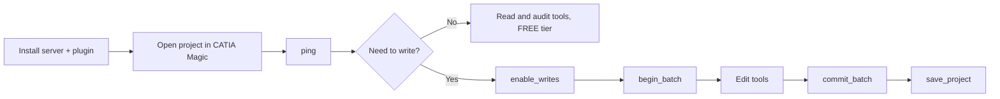

<!--
Copyright (c) 2026 JG Systems Consulting Ltd. All Rights Reserved.
SPDX-License-Identifier: LicenseRef-JGSystemsConsulting-Proprietary
-->

# JGS SysML v1 MCP Bridge: Usage Guide

How to work on a live SysML v1 model through the bridge once it is installed
(see [docs/install.md](install.md)). Every example names an MCP tool; you ask
your agent in plain language and it makes the calls. The complete tool list
with per-tool tiers is [docs/TOOL-REFERENCE.md](TOOL-REFERENCE.md).

## How a session is shaped



Every session starts in READ tier. Reading, auditing, and reporting work on
the FREE tier with no licence file. Writes need a PRO (or ENTERPRISE) licence,
the write secret from your licence delivery, and an explicit
[`enable_writes`](configuration.md#safety-tiers) call. Writes stay elevated
only for that session; a new session is READ again.

## First run

1. Launch CATIA Magic and open a SysML v1 project.
2. Ask your agent: "Call the `ping` tool on the jgs-sysmlv1 server."

Expected response:

```json
{
  "status": "ok",
  "plugin_version": "0.1.0",
  "protocol_version": "1",
  "timestamp_utc": "2026-..."
}
```

`ping` answering means the agent, the Python server, and the in-app plugin are
connected. `get_licence` reports your tier, seat count, and expiry if you want
to confirm what the session can do.

## Workflow: explore the model

The FREE-tier read tools answer "what is in here" questions without touching
the model:

| Ask your agent | Tools it will use |
|---|---|
| "Find everything named 'brake'" | `find_by_name`, `search` |
| "List all Requirement elements" | `find_by_type` |
| "Show the containment tree from the root" | `get_root_package`, `walk_tree` |
| "Describe block X and its parts and ports" | `describe_element`, `get_element_structure`, `get_ports` |
| "What relates to, allocates to, or uses element X?" | `get_relationships`, `get_allocations`, `impact_analysis` |

Element IDs returned by one call feed the next, so a typical exploration runs
`find_by_name` first and then `describe_element` or `list_children` on the
matches. The model being queried is the live project in CATIA Magic, so the
answers always reflect the state on screen.

## Workflow: audit requirements coverage

Quality tools run read-only on the FREE tier:

- `check_requirement_coverage` reports how many requirements are satisfied and
  verified.
- `export_requirements_matrix` returns the full traceability matrix with
  satisfy and verify links.
- `trace_requirement` follows one requirement through its derive, satisfy, and
  verify relationships.
- `validate_model` runs the tool's built-in rule checks and returns violations.
- `check_naming_conventions`, `find_unused_types`, `find_duplicates`, and
  `check_documentation_coverage` each target one hygiene dimension.

A useful first pass on an unfamiliar model: ask for `generate_model_summary`,
then `check_requirement_coverage`, then `validate_model`.

## Workflow: author a change (PRO)

Writes go through a safety gate and, for anything structural, a batch. A
typical change looks like this:

1. Call `enable_writes` with your write secret. The session is now in WRITE
   tier.
2. Open a batch with `begin_batch`. Everything you queue inside the batch
   commits atomically or not at all.
3. Make the edits. For example: `create_requirement` under a package ID, then
   `set_requirement_id` and `set_requirement_text`, then `create_allocation`
   or `add_satisfy` to tie it to the design.
4. Commit with `commit_batch`, or roll the whole thing back with
   `abort_batch`.
5. Persist the project with `save_project`.

`undo` and `redo` work on the project's edit stack, and `get_edit_history`
shows recent changes. Delete and other structural destruction sits behind
`enable_dangerous_writes` (ENTERPRISE tier) so it cannot happen by accident.

## Workflow: produce a diagram (PRO)

`create_diagram` makes a diagram of a chosen kind (BDD, IBD, Parametric,
Requirement, Activity, StateMachine, UseCase, Package, Sequence).
`populate_diagram` drops the elements you name onto it, `auto_layout_diagram`
or `apply_custom_layout` tidies the arrangement (preview styles for free with
`list_layout_styles` and `compare_layout_styles`), and `export_diagram_image`
returns a rendered image your agent can paste into a report.

## Failure and recovery

| Symptom | Likely cause | Fix |
|---|---|---|
| `Connection refused` on `ping` | Plugin not loaded, or CATIA Magic not running | Check the plugin directory layout in [docs/install.md](install.md), then restart CATIA Magic |
| `401 Unauthorized` | Wrong or missing write secret | Verify `JGS_V1_WRITE_SECRET` matches the value supplied with your licence ([docs/configuration.md](configuration.md)) |
| `403 Forbidden` on a write tool | Session still in READ tier, or licence below PRO | Call `enable_writes`; check `get_licence` for your tier |
| Tools error immediately | No project open | Open a SysML v1 project in CATIA Magic |
| Server cannot find the bridge | Port/token files missing or non-standard install | Set `JGS_V1_ENDPOINT` per [docs/configuration.md](configuration.md) |

If a tool returns malformed or incorrect output, open an issue with the Bug
Report form (see the README Support section) and include the server version
from `ping`, the tool name, and the raw output.
